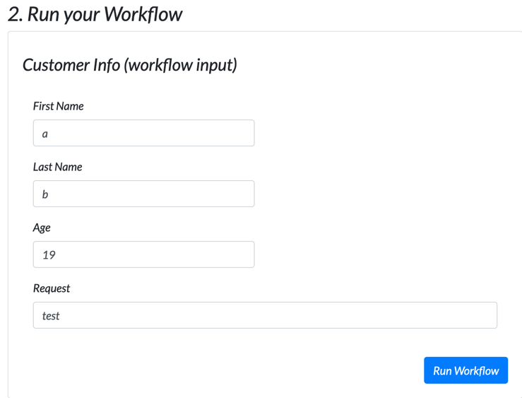
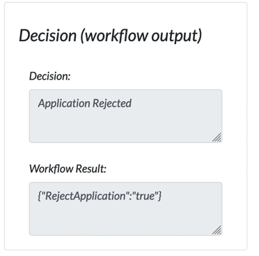
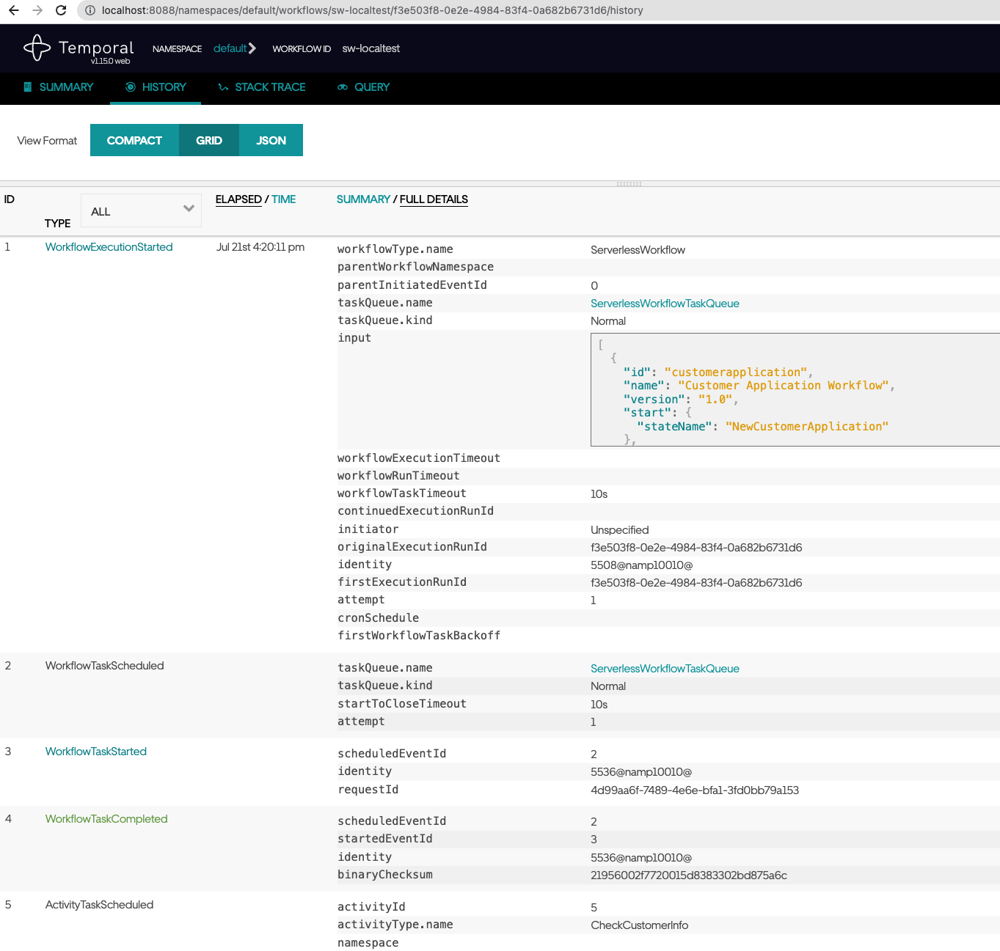

# Go's execution engine for Serverless Workflow on Temporal.io

A small demo to execute Serverless Workflow on Temporal.io with inspiration and front-end code borrowed from https://github.com/tsurdilo/swtemporal

## Limitations

This is a very rough implementation for demo purposes therefore **a lot** of Serverless Workflow features have not been even remotely touched.

Some notable limitations that are consciously aware

* Only support **operation** and **switch** states (no eventing etc)
* Only support sequential action execution (no parallel)
* Do not support function arguments
* Switch states are described using Go template conditions

## Run
1) You need a Temporal service running. See README.md for more details.
```bash
    git clone https://github.com/temporalio/docker-compose.git
    cd  docker-compose
    docker-compose -f docker-compose-cass-es.yml up
```
2) Run worker
```bash
go run worker/main.go
```
to start worker for dsl workflow.
3) Run editor + starter
```bash
go run starter/main.go
```
4) Open [localhost:3000](http://localhost:3000) and add a customer info and press **Run Workflow**



For rejected application 



The starter log

```text
2022/07/21 16:19:57 editor listening on :3000...
2022/07/21 16:19:57 INFO  No logger configured for temporal client. Created default one.
2022/07/21 16:19:57 starter listening on :8080...
2022/07/21 16:20:11 Started workflow WorkflowID sw-localtest RunID f3e503f8-0e2e-4984-83f4-0a682b6731d6
2022/07/21 16:20:11 Workflow result: {"RejectApplication":"true"}
```

5) To see the executed workflow goto [localhost:8088](http://localhost:8088/)

